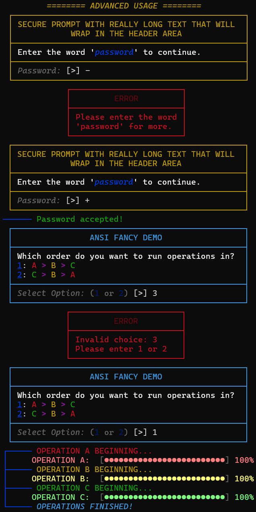
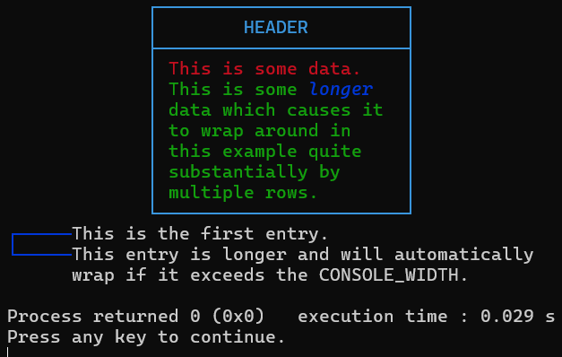

# 🎨 ANSI Fancy C

A header-only C library for Windows to create colorized formatted text in the command-line interface.

---

## 📖 Overview

This project provides a simple way to format terminal output with box-drawing characters and color support. It includes automatic word-wrapping and structural management, perfect for CLI tools that need to present hierarchical data or stepwise logs.

### ✨ Features
* **24-Bit Color:** Access to 16,777,216 different colors (with additional 8-bit color support).
* **Font Styles:** Acess to 7 different font options, including Bold, Underlined, and Italic.
* **Flows:** Create grouped, connected lists of text with customizable indentation.
* **Menu Boxes:** Create centered boxes with a header and listed content items.
* **Menu Boxes with Prompts:** Create Menu Boxes which prompt the user for input.
* **Menu Boxes with Secure\* Prompts:** Create Menu Boxes which prompt the user for input, while hiding the input.
* **Progress Bars:** Create customizable loading bars, compatible with flows.

\* *Best used alongside encryption if the data is stored.*
<p align="center">
  
</p>

---

## 📂 File Structure

| File | Description |
| :--- | :--- |
| `ANSI_Fancy_Config.h` | Contains user-adjustable settings, ANSI escape sequence definitions, and useful helper functions. |
| `ANSI_Fancy.h` | The core library. |
| `main.c` | A demonstration program showing how to use the library's features. |

---

## 🚀 Quick Start

1.  Include `ANSI_Fancy.h` in your project.
2.  Call `InitializeConsole()` at the very beginning of your `main` function.
3.  Add a (null terminated) char pointer array for the menu content.
4.  Use the MenuBox function to display some data.
5.  Use the `Flow` functions to structure your output.
6.  Track progress in stepwise events using progress bars.

```c
#include <stdio.h>
#include <stdlib.h>
#include "ANSI_Fancy.h"

int main() {
    // Enable ANSI escape sequences and UTF-8 output.
    InitializeConsole();

    // Add some data to an array for content.
    char *menuBoxContent[] = {
    ANSI_RED "This is some data." ANSI_RESET,
    ANSI_GREEN "This is some " ANSI_SLANT ANSI_BLUE "longer" ANSI_RESET ANSI_GREEN " data which causes it to wrap around in this example quite substantially by multiple rows." ANSI_RESET,
    NULL
    };

    // Display a cyan box with the data inside.
    MenuBox(ANSI_CYAN, 25, 3, "HEADER", menuBoxContent);

    // Start a blue flow with 5 units of indent.
    FlowStart(ANSI_BLUE, 5);

    FlowAdd("This is the first entry.");
    FlowAdd("This entry is longer and will automatically wrap if it exceeds the CONSOLE_WIDTH.");

    // Close the flow with the bottom connector.
    FlowFinish();

    printf("\n");
    
    // Initial creation of the bar (isUpdate = 0).
    ProgressBar(GetRGBColor(64, 255, 64), 256, "PROGRESS: ", 0, 100, 0); 

    // Simulate progress updates.
    for (int i = 1; i <= 100; i ++) {
        Sleep(5);                                                                   // Wait 5 milliseconds (0.005 seconds) to simulate processing.
        ProgressBar(GetRGBColor(64, 255, 64), 256, "PROGRESS: ", i, 100, 1);        // Update the loading bar (isUpdate = 1).
    }
    ProgressBar(GetRGBColor(128, 255, 128), 256, "PROGRESS: ", 100, 100, 1);        // Update the loading bar with a brighter color once it completes.
}
```
Output (with CONSOLE_WIDTH set to 52):
<p align="center">
  
</p>
